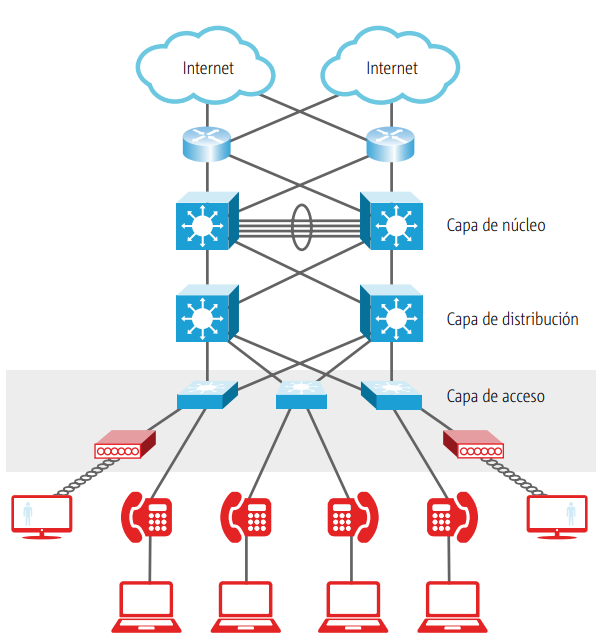

# Diseño de redes

En entornos pequeños, como es el caso de las llamadas redes SOHO (Small Office, Home Office) el diseño de la red no tiene demasiada importancia: hay pocos dispositivos y es poca la inversión económica a realizar. Todo lo contrario, ocurre en entornos mediano y grande, donde es importante un diseñar correctamente la red para facilitar el acceso a todos los usuarios de una manera efectiva, ofreciendo mecanismos de tolerancia a fallos y de seguridad, y permitiendo el crecimiento en el futuro para escalar la infraestructura de red de la empresa según sus necesidades. Todo esto, además, debe hacerse intentando minimizar los recursos necesarios para el diseño.

En redes pequeñas es común ver el mal diseño de las redes: lo más habitual es conectar los equipos sobre la marcha, utilizar el primer puerto disponible del switch sin preocuparnos gran cosa. Y si nos quedamos sin puertos, conectamos otro switch en el puerto disponible de otro y listo.

Pensar de este modo nos puede generar un problema cuando la red va creciendo y se vuelve grande, el acceso de algunos equipos a otros puede suponer un recorrido en el cableado de red que incremente la latencia de acceso. Además, debemos tener en cuenta que, si un switch falla, las pérdidas de conectividad en la red pueden ser importantes por una mala planificación.

Si bien no resulta grave en entornos pequeños resulta inviable en entornos de red grandes. Por lo que, para simplificar el diseño y optimizar los rendimientos y ofrecer tolerancia a fallos y una alta disponibilidad, se define un diseño de red de forma jerárquica y estableciendo claramente las funciones de las que debe encargarse cada una de las capas de la jerarquía.

Este tipo de diseño consta de tres capas:

1. Acceso: conecta los equipos finales a la red. Los switches que encontramos en este nivel son de capa 2.
2. Distribución: redirige el tráfico que sale de un switch de acceso a otro o a la capa de núcleo. Los switches de este nivel son de capa 3.
3. Núcleo: permite la conexión con otros segmentos de red fuera de nuestra infraestructura. Por ejemplo: cuando tenemos redes que conectan diferentes edificios dentro de una misma empresa. Los switches de este nivel son de capa 3 o superiores.

<figure><figcaption>
Tomado de CCNA
</figcaption></figure>

#### Capa de acceso

Esta capa es la que permite la conexión de cada usuario a la red. También denominada capa de acceso de trabajo, capa de escritorio o capa de usuario. Tanto los propios usuarios como los recursos a los que estos necesitan acceder con más frecuencia están disponibles a nivel local.

La capa de acceso se encarga principalmente de conectar equipos clientes a la red de la empresa, aunque también encontramos dispositivos como impresoras pequeñas, puntos de acceso inalámbricos con poco uso o servidores departamentales, que también debemos conectar a la capa de acceso.

El tráfico hacia y desde los recursos locales está confinado entre los recursos, switches y usuarios finales.

En muchas redes no es posible proporcionar a los usuarios un acceso local a todos los servicios: bases de datos, almacenamiento centralizado o el acceso telefónico a la web. En estos casos, el tráfico de usuarios que demanda estos servicios se desvía la siguiente capa del modelo: la capa de distribución.

Funciones de esta capa:

1. Interconexión de los diferentes grupos de trabajo hacia la capa de distribución
2. Segmentación en múltiples dominios de colisión
3. Soporte a tecnologías Ethernet y Wireless
4. Implementación de redes virtuales – VLAN

En esta capa los switches de acceso son de capa 2 que realizan las siguientes funciones:

* Trabajar en capa 2: permite abaratar costes en la infraestructura.
* Proporcionar alta disponibilidad: para acceder a la capa de distribución, deberemos tener caminos redundantes a varios switches de distribución y así garantizar la continuidad de la conexión en caso de que un switch de distribución deje de funcionar.
* Seguridad de puertos: deberemos evitar accesos no autorizados a la conexión de red. Para ello, el switch soporta diferentes mecanismos que evitan accesos no autorizados a la red.
* Etiquetado de tráfico para calidad de servicio (QoS): debería poder marcar el tráfico para que se dé prioridad a tráficos importantes como los de voz IP o de videoconferencias, entre otros.
* Soporte para protocolo Spanning Tree: al tener caminos redundados a la capa de distribución, se evitarán los problemas que estos ocasionan utilizando el protocolo Spanning Tree.
* Soporte para PoE (Power over Ethernet): permiten que un puerto Ethernet suministre voltaje eléctrico para conectar dispositivos como teléfonos IP o puntos de acceso inalámbricos, entre otros. De esta manera, se simplifica la estructura de cableado que tenemos en la empresa, ya que podemos eliminar algunos de los cables de corriente eléctrica. 

En un switch de acceso no es necesario implementar todas las funciones, pero cada una de ellas aporta un extra que puede resultar muy práctico al conectar los equipos finales en la red.

### Capa de distribución 

Esta capa marca el punto medio entre la capa de acceso y el núcleo, donde se encuentran los servicios principales de la red. En esta capa se realizan funciones como el enrutamiento, filtrado y acceso a la WAN.

En los entornos de campus, esta capa abarca una gran diversidad de funciones, algunas de las cuales son:

* Servir como punto de concentración para acceder a los dispositivos de capa de acceso
* Enrutar el tráfico para proporcionar acceso a los departamentos o grupos de trabajo y entre las diferentes VLAN.
* Segmentar la red en varios dominios de difusión/multidifusión.
* Traducir los diálogos entre los diferente tipos de medios, como Token Ring y Ethernet
* Proporcionar servicios de seguridad y filtrado

Algunos equipos que podemos conectar a la capa de distribución son los switches de acceso y de núcleo y los servidores de infraestructura a los que deben acceder todos los equipos de la red, como servidores de DNS, servidores de DHCP, de directorio activo, etc.

Un switch de la capa de distribución ha de soportar las siguientes funciones:

1. Switches de capa 3: ofrecen mayor rendimiento que los de capa 2 y permiten determinar la ubicación del equipo destino al que se debe enviar la trama revisando la dirección IP en lugar de utilizar la dirección MAC. Los switches de capa 3 están pensados para conmutar tráfico entre las VLAN.
2. Agregación de puertos: para conectar con las capas superior e inferior o para conectar con otros switches de distribución, es recomendable crear grupos de puertos que trabajen conjuntamente como uno solo, ya que así dejan disponible más ancho de banda y mayor tolerancia a fallos en la conexión.
3. Listas de control de acceso: debe permitir crear listas de control de acceso para decidir qué tráficos se permiten enviar de un segmento de red a otro.
4. Protocolos de enrutamiento: aunque el dispositivo es un switch y los protocolos de enrutamiento son propios de routers, al tratarse de un switch de capa 3, realiza funciones de enrutamiento con otros routers y para ello permite configurar ciertos protocolos de enrutamiento como OSPF o EIGRP.
5. Sumarización de rutas: para la conexión con la capa de núcleo, el switch debe permitir enviar las rutas sumarizadas para que la capa de núcleo pueda simplificar el tamaño de sus tablas de enrutamiento.
6. Redundancia y balanceo de carga: debe soportar mecanismos de tolerancia a fallos para evitar los problemas que supondría el fallo de uno de los switches en la topología de la empresa.

### Capa de núcleo 

La capa del núcleo o core se encarga de desviar el tráfico lo más rápidamente posible hacia los servicios apropiados. Por lo general, el tráfico se origina y proviene de servicios comunes a todos los usuarios, conocidos como servicios globales o corporativos. Algunos de estos servicios son: email, acceso a Internet o videoconferencias.

Cuando un usuario necesita acceder a un servicio corporativo, la petición procesa la petición a nivel de la capa de distribución y éste envía la petición del usuario al núcleo. Finalmente, el núcleo se limita a proporcionar un transporte rápido hasta el servicio solicitado. Por lo que los dispositivos de la capa de distribución se encargan de proporcionar un acceso controlado a la capa de núcleo.

Resumiendo, la capa de núcleo está pensada para la interconexión de oficinas. Esta interconexión se puede hacer en un campus, con una conexión de fibra óptica entre sus diferentes edificios, o bien por medio de una conexión WAN que interconecte las diferentes oficinas, que pueden estar situadas en la otra punta del mundo.

Para la interconexión entre las oficinas se pueden utilizar switches de capa 3 o superiores. Un switch de la capa de núcleo debería soportar las siguientes funciones:

1. Alta velocidad de conmutación: conectividad entre las diferentes oficinas con un alto ancho de banda y muy baja latencia para que la conexión tenga prestaciones equivalentes a las de una conexión en la LAN.
2. Alta disponibilidad y tolerancia a fallos: en el caso de una conexión en un campus, se debería implementar una red redundada que ofreciera disponibilidad en caso de que una de las conexiones falle. Una manera de hacerlo podría ser montar un doble anillo de fibra óptica que interconecte las oficinas. En caso de que el acceso se tenga que hacer a través de una WAN, se ha de plantear la posibilidad de utilizar dos proveedores de conexión diferentes para ofrecer garantías en el caso de que uno de ellos falle.
3. Infraestructura escalable: si la infraestructura de red se ha de modificar para cubrir nuevas necesidades de acceso remoto, los switches deben poder soportarlo. Para ello, normalmente se utilizarán switches modulares que permitan conectar componentes que ofrezcan estas funcionalidades extra.
4. Alto rendimiento de CPU: para procesar los tráficos entrantes y salientes y poder proporcionar funciones de seguridad, de inspección de tráfico y de calidad de servicio, se necesitarán equipos con potencia de CPU y memoria RAM suficientes. 

Las prestaciones que debe ofrecer un switch de núcleo hacen que los precios sean elevados. Por eso, empresas de tamaño mediano optan por combinar las capas de distribución y de núcleo en una sola capa, sumando las funciones de ambas en una sola; aunque se asume que algunas de las funciones no serán viables, se reduce notablemente el coste de los dispositivos de red.

#### Resumen 

<table data-header-hidden><thead><tr><th width="129">Capa</th><th width="313">Funciones</th><th>Dispositivos</th></tr></thead><tbody><tr><td>Núcleo</td><td>Conmuta el tráfico hacia el servicio solicitado, comunicación rápida y segura</td><td>Routers, switch multicapa</td></tr><tr><td>Distribución</td><td>Enrutamiento, filtrado, acceso WAN, seguridad basada en políticas, servicios empresariales, enrutamiento entre VLAN, definición de dominios de broadcast y multicast.</td><td>Router</td></tr><tr><td>Acceso</td><td>Define dominios de colisión, etaciones finales de trabajo, ubicación de los usuarios, servicios de grupos de trabajo, VLAN.</td><td>Switch, hub</td></tr></tbody></table>

#### Modelo de core colapsado

El diseño jerárquico en tres niveles maximiza el rendimiento, la disponibilidad de la red y la capacidad de escalar el diseño de la red. Para las empresas pequeñas que no crecen de manera significativa en el tiempo, es recomendable un diseño de dos capas, donde la capa de núcleo y de distribución se colapsan en una sola capa. Esto permite la reducción de costos de la red a la vez que mantiene la mayor parte de los beneficios del modelo jerárquico en tres niveles.

Por tanto, las funciones de la capa de distribución y la capa de core están aplicadas en un solo dispositivo que debe proporcionar las siguientes funciones:

* Rutas físicas y lógicas de alta velocidad de conexión a la red
* Servir como punto de demarcación entre acceso y núcleo y de concentración de capa 2
* Definir las políticas de acceso y enrutamiento
* Proveer calidad de servicios (QoS), virtualización de la red, etc.

<figure><figcaption>
Tomado de CCNA
</figcaption></figure>

