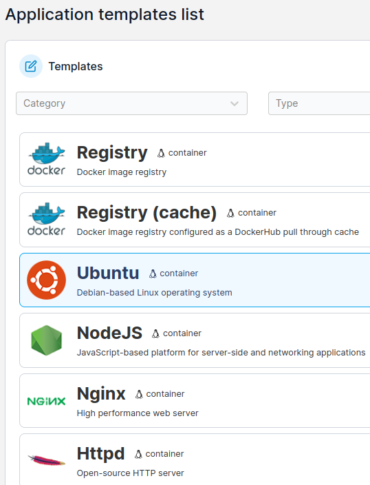

# DMZ

## DMZ -  Zona Desmilitarizada

Se trata de una red que se encuentra entre la red interna de una organización e Internet (red no confiable). En una configuración típica la DMZ ofrece servicios y recursos que necesitan ser accesibles desde Internet, como puede ser: servicio web, servicio de correo electrónico, etc. Estos servicios de la DMZ están expuestos a amenazas, pero se encuentran fuera de la red interna, separadas por uno o más firewalls, según el diseño de la red establecido.

La configuración de la DMZ se establece de modo que el tráfico desde y hacia Internet pueda acceder a los servicios en la DMZ, pero evitando el acceso a la red interna de la organización. Esto se consigue mediante reglas de firewall y configuraciones de enrutamiento que permiten el control  del tráfico de datos entre las diferentes zonas de la red.

### Nuestro escenario

Vamos a utilizar el mismo escenario que ya tenemos configurado donde usamos dos adaptadores de red:&#x20;

* adaptador puente para la salida a Internet
* adaptador solo anfitrión para la LAN

Pues vamos a habilitar un tercer adaptador para la DMZ, esto es:

* adaptador de red interna

En mi caso, queda algo como lo siguiente:

| Adaptador      | Red                             |
| -------------- | ------------------------------- |
| Puente         | 192.168.1.53 /24 \| DHCP        |
| Solo anfitrión | 192.168.56.2 /24 \| IP estática |
| Red Interna    | 172.27.1.2 /24 \| IP estática   |

En mi pfSense se puede ver de la siguiente manera:

<figure><figcaption>
Configuración del pfSense
</figcaption></figure>

### A tener en cuenta

Para habilitar la DMZ necesitas primero tener apagada la VM del pfSense, agregar el tercer adaptador de red en modo red interna y encender el firewall. Adicionalmente, tenemos que agregar la interfaz para la DMZ.

<figure><figcaption>
Las tres interfaces de red
</figcaption></figure>

Las direcciones IP de las interfaces de red LAN y DMZ son IP estáticas y en las mismas tenemos que configurar el servicio DHCP para que le brinde direcciones IP a las VM que vamos a conectar por cada interfaz de red, esto es:

| Interfaz | IP de inicio   | IP final       |
| -------- | -------------- | -------------- |
| LAN      | 192.168.56.200 | 192.168.56.210 |
| DMZ      | 172.27.1.200   | 172.27.1.210   |

La siguiente imagen muestra las asignaciones de las IP a las VM conectadas por cada interfaz de red: LAN y DMZ.

<figure><figcaption>
Las IP asignadas a las VM conectadas a las redes LAN y DMZ
</figcaption></figure>

## Configurando la DMZ

Ahora es que nos vamos a disponer a configurar el tráfico por la DMZ. Lo primero será crear un par de alias que nos sirve para minimizar el número de cambios que tienen que hacerse si un equipo, red o de puerto es modificado.&#x20;

Para probar el tráfico de datos a través de la DMZ vamos a considerar solo el protocolo ICMP (ping) y los puertos 80 / 443 para la web. Para ello vamos a configurar un par de aliases:

Nos vamos a Firewall > Alias > Port y creamos el primero de los aliases, esto es:

<figure><figcaption>
Alias para los puertos 80 / 443 
</figcaption></figure>

Hacemos lo mismo para el puerto 53 del DNS y nos debe quedar algo como lo siguiente:

<figure><figcaption></figcaption></figure>

### Reglas para la DMZ

Para acceder a Internet necesitamos de los protocolos http (80) y https (443) con el protocolo TCP y UDP para la resoluciones del **DNS**. Para ello nos vamos a firewall > rules y vamos a configurar lo siguiente:

* Action: pass
* Interfaz: DMZ
* Address Family: IPv4
* Protocol: ICMP / Subtypes: any
* Source: DMZ subnets
* Destination: Any

Si probamos vemos que es capaz de hacer un ping tanto a una IP de Internet como es el caso de la 1.1.1.1 y a la VM que tenemos conectada a nuestra LAN con la IP 192.168.56.200. Sin embargo, si quisiera conectarme por SSH a la VM de la LAN no podré hacerlo.

<figure><figcaption>
Haciendo pruebas de conexión
</figcaption></figure>

### Notas

Adicionalmente creé dos reglas: una regla para la WAN y otra para la DMZ permitiendo el tráfico por el puerto 53 de DNS.&#x20;

En el caso de la WAN sería permitiendo el tráfico con destino a la DMZ por el puerto 53 de DNS.

<figure><figcaption>
Regla en la interfaz WAN para permitir el tráfico de DNS a través del puerto 53
</figcaption></figure>

En el caso de la  DMZ sería permitiendo el tráfico con origen en la DMZ y hacia cualquier red por el puerto 53.

<figure><figcaption>
Regla para la interfaz DMZ para permitir el tráfico de DNS a través del puerto 53
</figcaption></figure>

Tengo que testearlo mejor para evitar que entre en conflicto con las reglas de la VPN que tengo establecida y asegurar que:

* desde la DMZ no haya acceso a la red LAN
* desde la WAN no tengamos acceso a la red LAN
* desde la LAN podamos tener acceso tanto a la DMZ como a la WAN

¿Me ayudas a pensar? Te lo agradeceré.
