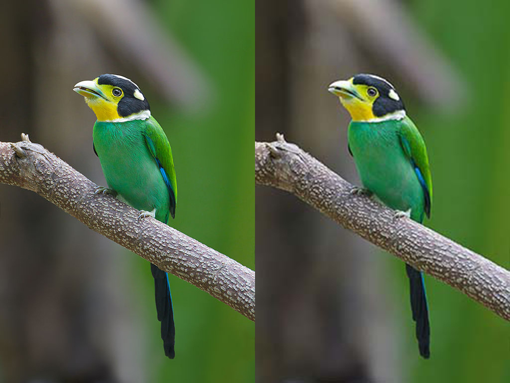

# Algo de imágenes y vídeos

Este mundo de las imágenes y los vídeos es fascinante. Hace un par de años tuve un colega muy joven, Isaac, que había estudiado Telecos con especialidad en audiovisuales. Algunas cosas me explicó y me quedé con ganas de aprender más. Después tuve dos alumnos a los que le gustaba el tema de la música y por ellos aprendí sobre FFmpeg. Este curso tenemos otro alumno al que le gusta la música y espero que algo más me enseñe.

Comencemos por aclarar que es la codificación.

La codificación es el proceso que toma los datos a transmitir y los convierte en un formato aceptable para la transmisión. Codificar permite convertir los datos a un formato específico para su almacenamiento o transmisión. Este proceso es completamente reversible si conocemos el método utilizado para codificar, por tanto, no confundir con cifrar porque no se trata de un método de seguridad.

Por tanto, la decodificación permite invertir  el proceso de codificación facilitando la interpretación de  la información.&#x20;

Algunos ejemplos de codificación de caracteres, bien conocidos son:  ASCII, Unicode, UTF-8, Base64.\

Algunos **tipos de codificación** son:

* Binaria: 0/1
* Caracteres: ASCII, Unicode, ISO-8859
* Imágenes: JPEG, PNG, BMP
* Audio: MP3, WAV, AAC
* Video: AVI, MP4, MKV

Cada formato de imágenes, vídeo y audio utiliza diferentes algoritmos de compresión y descompresión.

## Compresión de imágenes

La compresión de imágenes es un proceso que reduce el tamaño de los archivos de imagen. Funciona eliminando bytes de información de la imagen o utilizando un algoritmo de compresión de imágenes reescribiendo el archivo de imagen a fin de que ocupe menos espacio de almacenamiento con mayor o menor pérdida de calidad de la misma.

En sitios web, comprimir una imagen nos asegura que se cargue rápidamente cuando el usuario visualiza el sitio web o aplicación, siendo una parte importante de la optimización de imagen.

### Compresión con pérdida

Este tipo de compresión de imágenes conserva la información más significativa de la misma sin mantener cada píxel. Existen diferentes tipos de algoritmos cuyo principio de funcionamiento consiste en eliminar información del archivo, reduciendo el tamaño del mismo manteniendo una calidad visual "razonable". Por ejemplo: jpeg, png, gif.

#### JPEG

Este  tipo de archivos puede comprimir archivos en una proporción de 10:1 con una reducción mínima de la calidad de imagen, por tanto, minimiza la pérdida de calidad percibida,  aunque se pierde calidad en cada compresión. Se trata de un formato de imagen adecuado para fotografías y gráficos complejos y no es ideal para imágenes con texto o gráficos con bordes nítidos. Permite obtener una elevada compresión y mantener a su vez una buena calidad en la imagen.

Dado que el ojo humano es más sensible a los detalles de brillo que al color, se permite reducir ciertos datos sin que la imagen pierda mucha calidad.

<figure><figcaption>
Tomado de <a href="https://commons.wikimedia.org/wiki/File:JPEG_compression_Example.jpg">https://commons.wikimedia.org/wiki/File:JPEG_compression_Example.jpg</a>
</figcaption></figure>

### Compresión sin pérdida

Entre los formatos que hacen este tipo de compresión encontramos:&#x20;

* **PNG** - comprime la imagen pero la compresión es totalmente reversible al formato original.
* **GIF** - formato de intercambio de gráficos, a menudo utilizado también en la web. Crea una tabla de 256 colores a partir de una tabla de 16 millones, de tal modo que si la imagen contiene menos de 256 colores, puede almacenar la imagen sin pérdida. Si por el contrario, la imagen contiene muchos colores, entonces el software que crea el gif pudiera utilizar un algoritmo que genere los colores más cercanos a los reales dentro de la paleta de 256. En función de la calidad del algoritmo encontrará o no el conjunto de colores óptimos dentro de los 256. También puede ajustar el llamado **error de difusión** que permite reajustar los colores de los píxeles vecinos corrigiendo el error en cada píxel.
* **BMP** - Suelen ser demasiado grandes para uso práctico en la web. Es un formato de almacenamiento sin compresión de imágenes propiedad de Microsoft.
* **RAW** – Este tipo de imágenes no están comprimidas en lo absoluto. Por ejemplo: muchas de las cámaras digitales toman fotos en RAW. No se trata de un método estandarizado con lo cual, cada marca puede tener su propia versión del mismo y nos obliga a usar el software de la cámara para poder visualizar las imágenes.

### Tipos de algoritmos

**Con** **pérdida**:&#x20;

* Codificación por transformación\

**Sin pérdida**:

* Run-length encoding (RLE)
* Codificación aritmética
* Codificación Huffman

## Compresión o codificación de vídeo

Los formatos de codificación de vídeo son métodos para optimizar los archivos de vídeo digital para diferentes tipos de plataformas, programas y dispositivos. Cada formato de codificación de vídeo se compone de dos partes principales:\
\- un códec\
\- un contenedor\

El <mark style="color:purple;">códec</mark> y el <mark style="color:green;">contenedor</mark> especifican la forma en que se almacena, transmite y visualiza la entrada de vídeo sin comprimir. En la transmisión, es importante que el formato de codificación sea compatible con el mayor número posible de dispositivos, para que el flujo esté disponible para todos los usuarios.

Por tanto, los <mark style="color:purple;">códecs</mark> se refieren a la forma en que se codifican el audio, el video u otros datos, mientras que los <mark style="color:green;">contenedores</mark> se refieren al archivo que contiene audio y video codificados.

<figure><figcaption>
Tomado de: <a href="https://www.profesionalreview.com/2023/08/12/codec-multimedia/">https://www.profesionalreview.com/2023/08/12/codec-multimedia/</a>
</figcaption></figure>

## Formatos de video

Para seleccionar el formato de vídeo adecuado necesitamos tener en cuenta tres factores principales:

* Disponibilidad de almacenamiento.
* Calidad de la salida de vídeo.
* Compatibilidad con diferentes reproductores o programas de vídeo.

Por ejemplo:

En caso de necesitar subir un vídeo a un sitio web, debemos considerar las limitaciones de ancho de banda y la calidad del vídeo. En este caso, pudiéramos utilizar el formato WebM que es un formato de archivo libre y compatible con Android y con la mayoría de los navegadores web y sitios de transmisión de vídeo HTML5 como YouTube. Además de que permite comprimir archivos de vídeo sin perder apenas calidad de vídeo.

En el caso de querer almacenar vídeos caseros  que no ocupen mucho espacio en disco podemos pensar en formato estilo MP4 porque conserva la calidad del vídeo tras la compresión y es compatible con la mayoría de programas y dispositivos.

### Codificación de vídeos

Se trata del proceso de convertir la entrada de vídeo sin comprimir en una forma que pueda ser almacenada y reproducida por diversos dispositivos. Dicho proceso implica dos subprocesos:

* **Compresión** - implica eliminar datos superfluos, lo que disminuye considerablemente el tamaño de un vídeo para que sea más manejable.
* **Transcodificación** - se trata del proceso de conversión de audio y vídeo de un formato a otro, lo que garantiza que un archivo de vídeo sea compatible con el reproductor de vídeo o la plataforma que se utiliza.

### Compresión de vídeos

Para comprimir videos es necesario eliminar aquellas imágenes y sonidos repetitivos determinados por el algoritmo del codec que comprime. Esta pérdida de imágenes y sonidos pasa prácticamente inadvertida al ojo humano. Está claro que los problemas surgen si quieres reducir un archivo a un tamaño `pequeño` conservando la misma resolución. En este caso es que vemos las imágenes pixeladas, granuladas.

La compresión de vídeo opera típicamente entre grupos de píxeles vecinos, conocidos o macro-bloques. Estos bloques de píxeles son comparados con el fotograma siguiente y el codec de compresión de vídeo envía solo las diferencias de esos bloques. Una vez la pérdida en la compresión del vídeo compromete la calidad de imagen, es imposible recuperar la imagen a su calidad original.

### Transmisión de vídeos

La transmisión de vídeos puede hacerse en directo y en vivo:

* Transmisión en **directo**: La transmisión de vídeo se segmenta, se comprime y se codifica en tiempo real.
* Transmisión en **vivo**: Los dispositivos de los usuarios que reciben la transmisión, descodifican y descomprimen el vídeo segmentado antes de reproducirlo.

### Códecs - codificador / decodificador

Son métodos para comprimir y descomprimir datos para que puedan ser transportados y recibidos fácilmente por diferentes aplicaciones. Se utilizan diferentes códecs para comprimir archivos de audio y vídeo, pero suelen funcionar de la misma manera. Los códecs codifican los archivos usando:

* compresión con pérdidas.
* compresión sin pérdidas.

#### Compresión con pérdida

Al igual que en el caso de las imágenes, este tipo de compresión simplifica el archivo de vídeo conservando solo las partes esenciales. El vídeo puede parecer pixelado o "borroso".

#### Compresión sin pérdida

Este tipo de compresión preserva la alta calidad del archivo de vídeo original al copiar con exactitud cada dato, haciendo que el tamaño del archivo resultante sea igualmente grande. Se fundamenta en conceptos de la teoría de la información, como la redundancia y entropía de los datos.

#### Contenedores

Un contenedor combina la transmisión de audio y vídeo en un único archivo de vídeo. Esto es:

* Audio codificado (códec de audio)
* Vídeo codificado (códec de vídeo)
* Metadatos\

Los <mark style="color:purple;">metadatos</mark> indican al reproductor de vídeo cómo coordinar los códecs de audio y vídeo, así como brindar subtítulos.  Algunos contenedores solo funcionan con un único tipo de códec y reproductor de vídeo, limitando las opciones de reproducción. Otros contenedores son compatibles con muchos tipos de códecs y reproductores de vídeo.

Las extensiones de los archivos de vídeo reciben el nombre de los contenedores que utilizan, en lugar de los códecs de audio y vídeo que contienen. Ejemplo de ello: un archivo de vídeo MP4 es en realidad un contenedor MP4.

#### Tipos más comunes de formatos de contenedores de vídeo

* **MP4** – se comprime el audio y el vídeo por separado, ofreciendo mayor calidad de vídeo (Android / iOS)
* **MOV** – creado por Apple, no ofrece tanta compresión como otros formatos. Compatible solo con QuickTime.
* **AVI** – creado por Microsoft, archivos más grandes porque prioriza la calidad del vídeo.
* **FLV** – creado por Adobe Flash, comprimen archivos de video sin perder calidad.
* **WebM** – desarrollado por Google, subconjunto del formato estándar abierto Matroska Video Container (MKV) y es una alternativa a MP4. De código abierto y fácil de usar.
* **MKV** o Matroska Multimedia Container - fue desarrollado en Rusia y es gratuito, de código abierto y compatible con casi cualquier códec, pero no así con muchos programas. Este formato es una opción razonable si quieres ver el vídeo en un TV u PC que utilice un reproductor de medios de código abierto como VLC o Miro.

#### Codificación de vídeo avanzada AVC / H264

Se trata del estándar de compresión de vídeo que más se usa actualmente. El AVC/H.264 puede codificar vídeo de alta calidad con una velocidad de bits más baja que los estándares de compresión más antiguos. La "velocidad de bits" es el número de unidades de información que hay que procesar por cada segundo de vídeo. El Blu-ray y una gran variedad de servicios de transmisión, incluyendo la televisión a la carta y en directo, utilizan H.264.\
A pesar de que en ocasiones su uso requiere el pago de derechos a las organizaciones que poseen las patentes del mismo, más del 90% del sector del vídeo utiliza H.264. Un estándar de compresión de video que puede ser utilizado en: MP4, AVI, MKV, MOV, FLV, TS.

#### Protocolos de transmisión que utilizan H264

Casi todos los protocolos de transmisión en la actualidad son compatibles con H.264:

* el Protocolo de transmisión en tiempo real (RTSP)
* Transmisión en directo HTTP (HLS)
* Transmisión dinámica HTTP (HDS)
* Transmisión adaptativa dinámica sobre HTTP (MPEG-DASH).

Algunas aplicaciones de video son:

* FFmpeg
* Plex
* Jellyfin
* Kode

Nosotros veremos FFmpeg y YT-DLP.

## Links

* [https://digitalcommunications.wp.st-andrews.ac.uk/2019/04/08/what-is-a-jpeg-file/](https://digitalcommunications.wp.st-andrews.ac.uk/2019/04/08/what-is-a-jpeg-file/)&#x20;
* [https://grupo.us.es/gtocoma/pid/pid6/pid61.htm](https://grupo.us.es/gtocoma/pid/pid6/pid61.htm)
