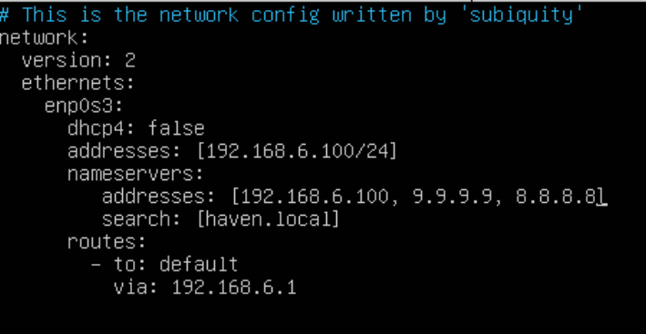

# RDP

### Protocolo de escritorio remoto

RDP es un protocolo de escritorio remoto disponible para la mayoría de los sistemas operativos. Este protocolo permite que el escritorio de un PC  sea controlado a distancia por un usuario remoto.

&#x20;RDP está encapsulado y cifrado dentro de TCP y se usa para la comunicación entre un terminal server y un cliente. Este protocolo se basa y es una extensión de la familia de estándares de protocolo `T-120`, siendo compatible con diferentes canales permitiendo canales virtuales independientes para llevar  información del tipo: datos, comunicación de dispositivo serie, Información de licencias, datos altamente cifrados, como el teclado, la actividad del mouse, etc.

### Funcionamiento

El protocolo RDP habilita un canal de red específico para enviar datos de ida y vuelta entre el escritorio remoto y el PC cliente a través del puerto 3389.&#x20;

* Los movimientos del ratón, las pulsaciones de teclas, la visualización del escritorio y el resto de datos necesarios se envían a través de este puerto por  TCP/IP  (protocolo de transporte).&#x20;
* También cifra los datos para que las conexiones a través de la Internet pública sean más seguras.
* Dado que las pulsaciones del  teclado y del ratón tienen que ser codificadas y transmitidas a través de Internet, es habitual que se produzcan ligeros retrasos, como es el caso de la visualización del escritorio tiene que ser transmitida de vuelta al usuario.&#x20;

### Seguridad

RDP tiene algunas vulnerabilidades de seguridad. Entre las vulnerabilidades más importantes tenemos:

* **Credenciales de inicio de sesión de usuario débiles**. La mayoría de PC están protegidas por una contraseña que puede no ser muy segura. En muchas ocasiones es utilizada dicha contraseña para iniciar sesión remota vía RDP. Las empresas no suelen gestionar este tipo de contraseñas y dejan las conexiones remotas abiertas a ataques de fuerza bruta.&#x20;
* **Acceso al puerto sin restricciones**. El puerto por defecto de  RDP  es el 3389, que puede ser utilizado para llevar a cabo ataques en ruta, entre otros.&#x20;
*   Otra de las vulnerabilidades más graves de RDP se denomina **BlueKeep** (CVE-2019-0708). Dicha vulnerabilidad permite a los atacantes ejecutar cualquier código que deseen en un PC si envían una solicitud  al puerto (generalmente 3389). Se trata de un gusano que puede propagarse a todas los equipos de una red sin mediación de los usuarios.&#x20;

    * &#x20;Microsoft emitió un parche que corrige esta vulnerabilidad en 2019 y es esencial que los administradores del sistema lo instalen.


* El RDP no necesita de una VPN para su uso y puede ser interesante para el trabajo en remoto, sin embargo los usuarios pueden experimentar retardo, si su conexión a Internet es lenta, por lo que puede  ser una experiencia frustrante. Finalmente, tiene vulnerabilidades de seguridad graves que lo dejan expuesto a ciberataques.

### Instalando xrdp en docker

Desde linuxserver: [https://docs.linuxserver.io/images/docker-rdesktop/](https://docs.linuxserver.io/images/docker-rdesktop/)

Me copié la versión Docker cli:

```
docker run -d \
  --name=rdesktop \
  --security-opt seccomp=unconfined `#optional` \
  -e PUID=1000 \
  -e PGID=1000 \
  -e TZ=Etc/UTC \
  -p 3389:3389 \
  -v /var/run/docker.sock:/var/run/docker.sock `#optional` \
  -v /path/to/rdesktop/data:/config `#optional` \
  --device /dev/dri:/dev/dri `#optional` \
  --shm-size="1gb" `#optional` \
  --restart unless-stopped \
  lscr.io/linuxserver/rdesktop:latest
```

Eliminé las líneas marcadas como #optional porque solo quiero hacer una prueba básica. Más adelante si haremos una configuración más completa.  De este modo estamos lanzando un contenedor a partir de una instancia de una imagen.&#x20;

```
docker run -d \
  --name=rdesktop \
  -e PUID=1000 \
  -e PGID=1000 \
  -e TZ=Etc/UTC \
  -p 3389:3389 \
  lscr.io/linuxserver/rdesktop:latest
```

Nota: El nombre de usuario y contraseña son: **abc/abc.**

Podemos comprobar que se nos ha creado el contenedor rdesktop y que está en ejecución.

<figure><figcaption><p>Contenedor lscr.io/linuxserver/rdesktop:latest</p></figcaption></figure>

Ahora necesitamos probar a conectarnos. Para ello necesitamos una aplicación cliente de escritorio remoto. En mi caso utilizaré Remmina porque me quiero conectar desde un PC con Debian. Remmina es una aplicación de código abierto diseñada para brindar acceso remoto a otros equipos y es compatible con protocolos como RDP, VNC, SSH.

Al acceder a la aplicación Remmina, se levanta una pantalla como la siguiente donde ponemos la IP:port por defecto de acceso:&#x20;

<figure><figcaption><p>Remmina</p></figcaption></figure>

<figure><figcaption><p>User: abc | Password: abc</p></figcaption></figure>

Y listo, ya tenemos acceso al contenedor donde tenemos instalado el escritorio remoto.

<figure><figcaption><p>El escritorio remoto </p></figcaption></figure>

<mark style="color:red;">To be continued ...</mark>

### Links

* [https://docs.linuxserver.io/images/docker-rdesktop/](https://docs.linuxserver.io/images/docker-rdesktop/)&#x20;
* Si quisiera instalar XRDP en modo standalone: [https://hayhost.am/knowledgebase/349/-How-to-Install-XRDP-Server-Remote-Desktop-on-Debian-11or12.html](https://hayhost.am/knowledgebase/349/-How-to-Install-XRDP-Server-Remote-Desktop-on-Debian-11or12.html)
* [https://www.cloudflare.com/es-es/learning/access-management/what-is-the-remote-desktop-protocol/](https://www.cloudflare.com/es-es/learning/access-management/what-is-the-remote-desktop-protocol/)

